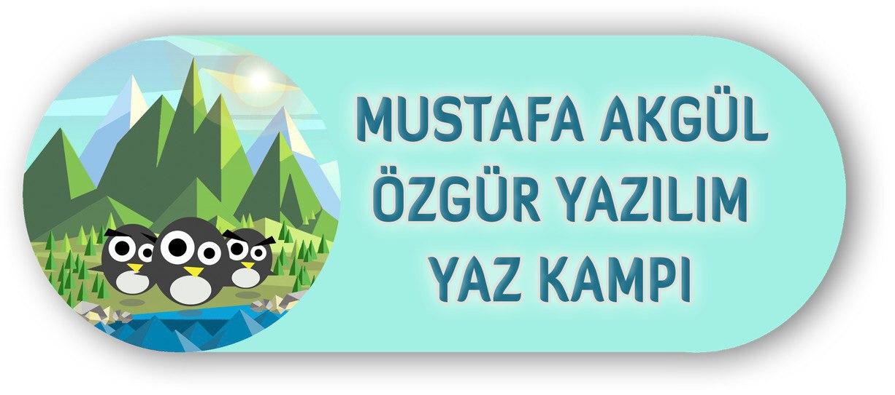
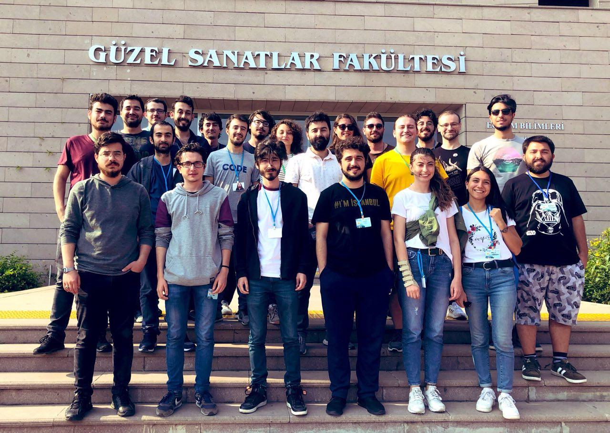
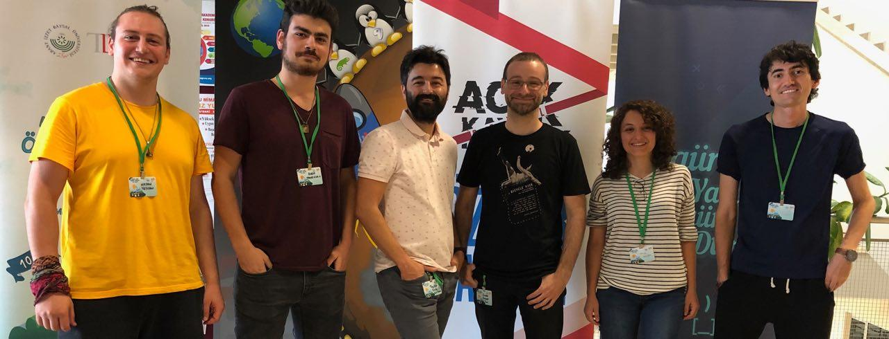

## Ruby / Rails - Özgür Yazılım Kampı 2019 Yaz

Kamp süreci boyunca aldığım notları temize çekerek yayımladığım repo.

Bu kursunda aldığı notları ham hali ile paylaşan eğitmen arkdaşımın notlarına göz atmak isterseniz.

Kurs organizasyonu: [**`https://github.com/ruby-rails-mustafa-akgul-oyyk-2019`**](https://github.com/ruby-rails-mustafa-akgul-oyyk-2019)  
Kurs içeriği: [**`https://kamp.linux.org.tr/ruby-on-rails-ile-web-programlama`**](https://kamp.linux.org.tr/2019/yaz/kurslar/ruby-on-rails-ile-web-programlama/)  
Kurs eğitmen sponsoru: [**`https://lab2023.com`**](https://lab2023.com)

| Gün | Konu Başlığı | Doküman | Uygulama |
|:-:|:------------:|:-------:|:--------:|
| 1 | Tanışma,  Kamp tanıtımı,  Temel GNU/Linux,  Özgür yazılım,  Ruby dünyasına giriş,   Kurulum| &bull; [**`Linux Nedir?`** ](https://github.com/PauSiber/gnulinux/blob/master/hafta0/hafta0.md#linux-nedir-)  &bull; [**`Temel Komutlar, Dosya sistem hiyerarşisi, Paket yöneticisi kavramı`**](https://gnulinux.pausiber.xyz/hafta-1.html)   &bull; [**`Ruby Nedir ?`**](docs/ruby-merve-sahan.pdf)   &bull; [**`Rails Nedir ?`**](docs/rails-merve-sahan.pdf)   &bull; [**`Rails Doktrini`**](https://speakerdeck.com/tayfunoziserikan/rails-doktrini) | **x** |
| 2 | Git,  Git-Flow,  Basit bir blog uygulaması yapımı | &bull; [**`Rails Guides - Getting Started`**](https://guides.rubyonrails.org/getting_started.html) | &bull; [**`Blog örneği`**](https://github.com/ruby-rails-mustafa-akgul-oyyk-2019/getting-started) |
| 3 | Özgür Yazılım Nedir?   Bundler,  Rbenv,  Rack,  Web nasıl çalışır | &bull; [**`3. Gün ders notları`**](posts/day3.md) | &bull; [**`Rack sunucu örneği`**](https://github.com/ruby-rails-mustafa-akgul-oyyk-2019/rack-example) |
| 4 | ... | ... | ... |
| 5 | ... | [ devamı gelecek...](https://github.com/hasantezcan/oyk_2019_yaz_ruby_rails#telegram-tmehasantezcan) | ... |

	

#### Katılımcılar
##### `Kamp boyunca yılmadan devam eden tüm katılımcı arkadaşlarıma teşekkür ediyorum.`

	

#### Kurs Eğitmenleri
- [**`@hasantezcan`**](https://github.com/hasantezcan)[**`@boratanrikulu`**](https://github.com/boratanrikulu)[**`@tayfunoziserikan`**](https://github.com/tayfunoziserikan)[**`@enderahmetyurt`**](https://github.com/enderahmetyurt)[**`@mrvsahan`**](https://github.com/mrvsahan) [**`@coskuntekin`**](https://github.com/coskuntekin)

	

---

**NOT:** Bu repo henüz tamamlanmış değildir. Tüm notları temize çekmek süre alıyor. Fakat yüklenen kısımında bulduğunuz eksiklikleri [**`PR atarak`**](https://github.com/hasantezcan/oyk_2019_yaz_ruby_rails/pulls) giderebilirsiniz. Bu sayade daha eksiksiz ve özgür bir kaynak oluşturmuş oluruz.

Benimle direk iletişime geçmek için;
##### telegram :[**`t.me/hasantezcan`**](https://t.me/hasantezcan)
